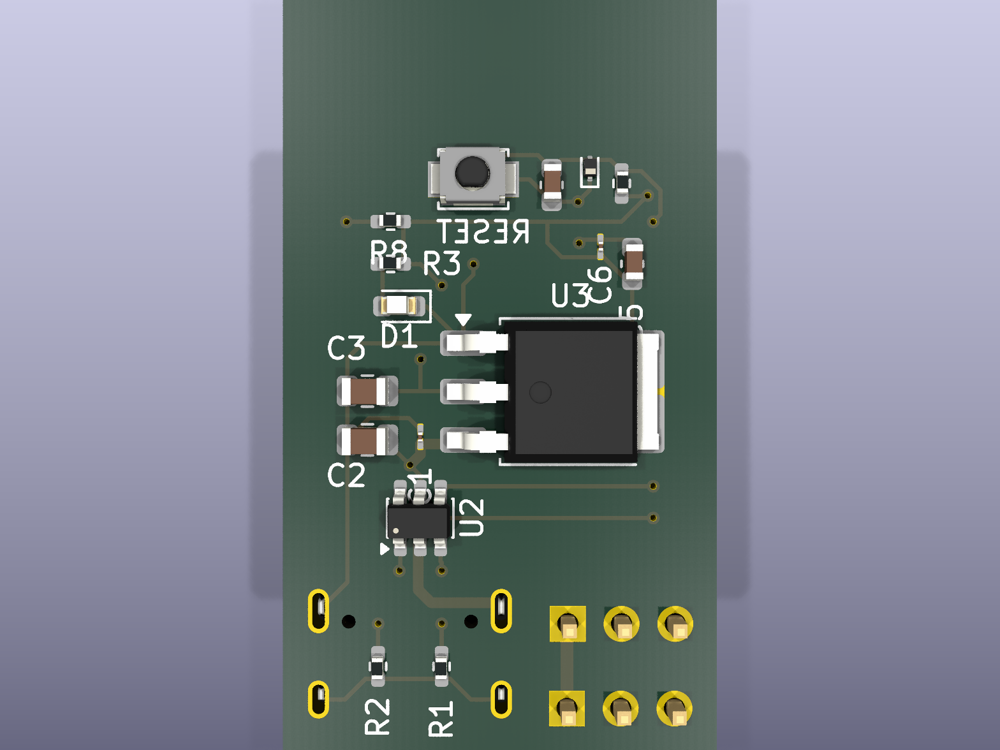
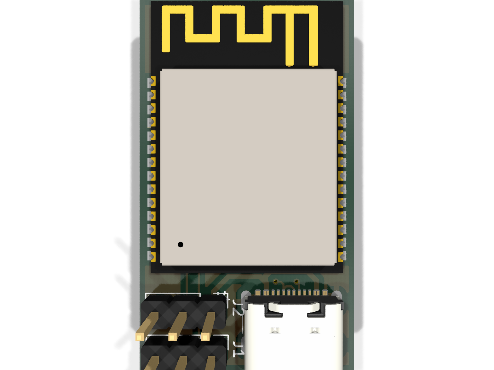
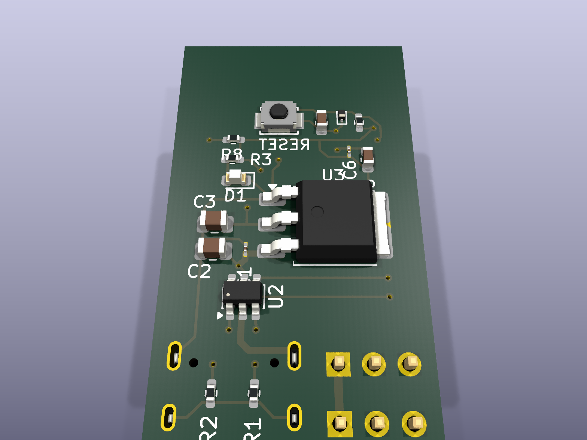
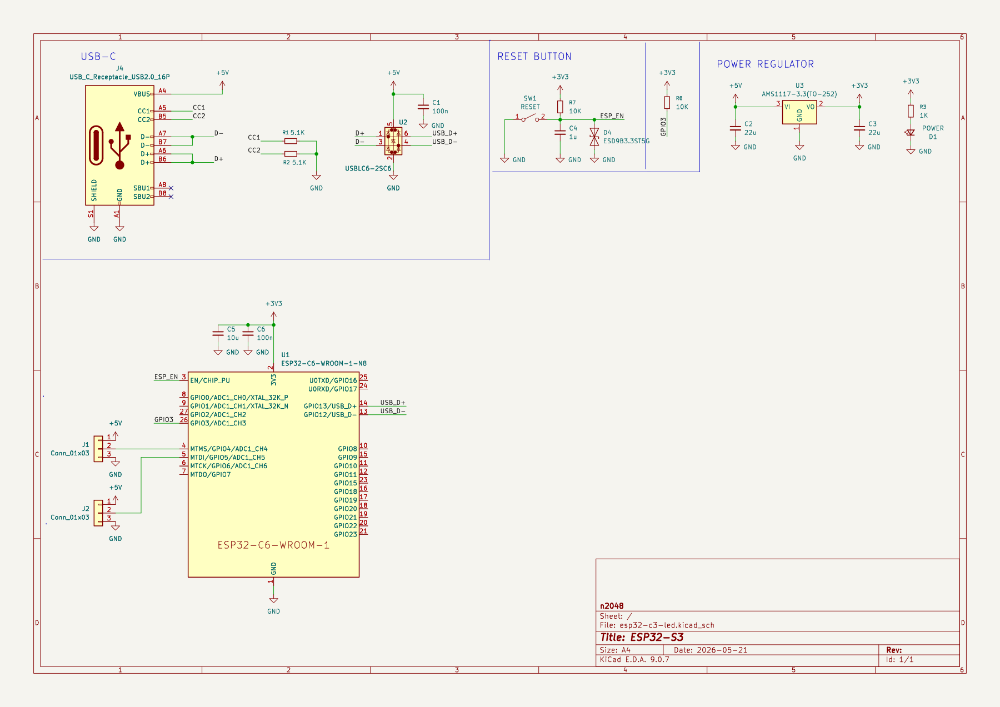
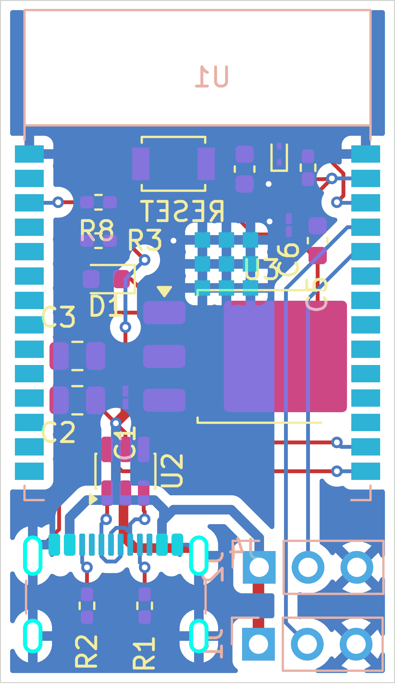

# ESP32-C6 LED Controller Board

A compact 2-layer PCB built around the **ESP32-C6-WROOM-1** module, providing
USB-C power/programming, on-board 3.3V regulation, ESD-protected USB
data lines, a reset button, and an addressable/status LED header. All
electronic parts are sourced against JLCPCB's live parts catalog for
turnkey assembly.

## 3D Renders

| Top side (regulator / passives) | Bottom side (ESP32 module / USB-C) |
|---|---|
|  |  |



## Schematic



Full-resolution vector version: [`docs/images/schematic.pdf`](docs/images/schematic.pdf)

## PCB Layout



*Copper (F.Cu / B.Cu), silkscreen, and solder mask layers, board outline shown.*

## Board Specs

- **Size:** 20.55 mm × 35.55 mm
- **Layers:** 2 (F.Cu / B.Cu)
- **MCU:** ESP32-C6-WROOM-1-N8 (Wi-Fi 6, Bluetooth 5 LE, Zigbee/Thread 802.15.4, 8 MB flash)
- **Power in:** USB-C (5V), on-board AMS1117-3.3 LDO regulator for 3.3V rail
- **USB protection:** USBLC6-2SC6-FS ESD protection on D+/D-
- **User I/O:** Reset button (SW1), status LED (D1), 2× 3-pin headers (J1/J2) for external LED/peripheral connections
- **ESD protection:** ESD9B3.3ST5G on EN line

## Bill of Materials

All parts verified against the live JLCPCB Open Platform API (real-time stock/pricing).
Full machine-readable BOM: [`BOM_jlcpcb_verified.csv`](BOM_jlcpcb_verified.csv)

| Ref | Part | LCSC # | Library |
|---|---|---|---|
| U1 | ESP32-C6-WROOM-1-N8 | C5366877 | Extended |
| U2 | USBLC6-2SC6-FS | C6807798 | Extended |
| U3 | AMS1117-3.3(TO-252) | C41347676 | Extended |
| D1 | KT-0603R (red LED) | C2286 | **Basic** |
| D4 | ESD9B3.3ST5G | C96512 | Extended |
| SW1 | B3U-1000P (tactile switch) | C231329 | Extended |
| J1, J2 | HX PH254-01-03-Z-L11.5 (1×3 header) | C52016391 | Extended |
| J4 | USB4105-GF-A (USB-C receptacle, 16P) | C3020560 | Extended |
| R1, R2 | 5.1kΩ 0402 | C25905 | **Basic** |
| R3 | 1kΩ 0402 | C11702 | **Basic** |
| R7, R8 | 10kΩ 0402 | C25744 | **Basic** |
| C1, C6 | 100nF 01005 | C307376 | Extended |
| C2, C3 | 22µF 0805 | C129302 | Extended |
| C4 | 1µF 0603 | C15849 | **Basic** |
| C5 | 10µF 0603 | C7472959 | Extended |

## Manufacturing

Board is set up for JLCPCB fabrication + assembly out of the box.
`production/` contains regenerated, verified fabrication files:

- `esp32-c3-led_gerbers.zip` — Gerbers + Excellon drill file (upload
  directly to JLCPCB's PCB order)
- `bom.csv` — JLCPCB-format BOM with a populated `LCSC Part #` column
  for every line (Comment / Designator / Footprint / LCSC Part #);
  each part number is a live, in-stock JLCPCB catalog match
- `positions.csv` — CPL / pick-and-place file (Ref, Val, Package,
  PosX, PosY, Rot, Side), regenerated from the current board so
  bottom-side parts (J1, J2, J4, U1) are correctly marked `bottom`

`esp32-c3-led.kicad_pro` / `.kicad_sch` / `.kicad_pcb` remain the
authoritative KiCad 9 source files; every part also carries `LCSC` and
`MPN` custom fields on its schematic symbol.

> **Note:** an earlier BOM/CPL pair generated by the Fabrication
> Toolkit KiCad plugin shipped with an empty `LCSC Part #` column,
> which caused JLCPCB's auto-matcher to select wrong/out-of-stock
> substitutes and fail to match the connectors (J1/J2/J4) entirely.
> The files above were regenerated directly from the schematic's
> verified LCSC data and confirmed against the live JLCPCB API —
> use these instead of re-running the plugin unless the design changes.

### Design Rule Check status

Verified clean via `kicad-cli pcb drc`: only 2 benign warnings remain
(`lib_footprint_mismatch` on C1/C6, confirming an intentional local pad
clearance override on the 01005 100nF caps — their `_HandSolder`
footprint variant was swapped for the standard machine-assembly
footprint to meet the board's clearance rule). No copper clearance
errors, no dangling/floating silkscreen text, no component placement
changes.

## Repo Layout

```
esp32-c3-led.kicad_pro      KiCad project
esp32-c3-led.kicad_sch      Schematic
esp32-c3-led.kicad_pcb      PCB layout
BOM_jlcpcb_verified.csv     Reference BOM with LCSC part numbers (grouped by value)
docs/images/                Renders and diagrams (this README)
production/                  JLCPCB-ready fabrication output:
  esp32-c3-led_gerbers.zip     Gerbers + drill (upload as-is)
  bom.csv                      JLCPCB BOM (Comment/Designator/Footprint/LCSC Part #)
  positions.csv                CPL / pick-and-place file
  gerbers/                     Individual Gerber/drill layer files
```
